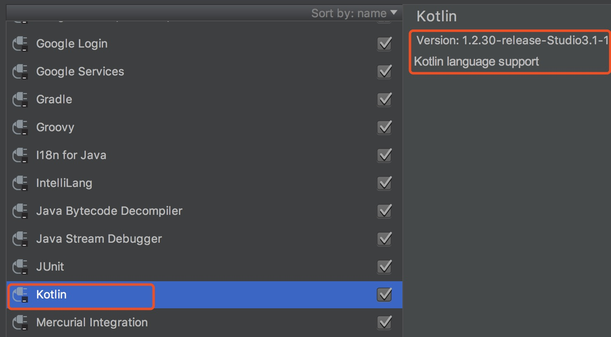
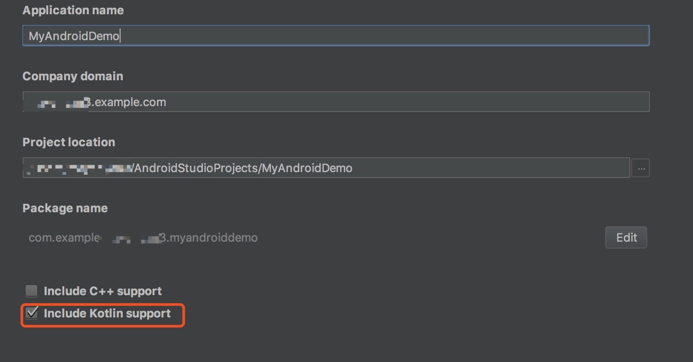
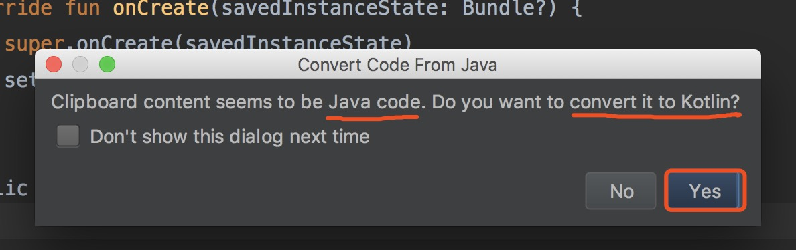
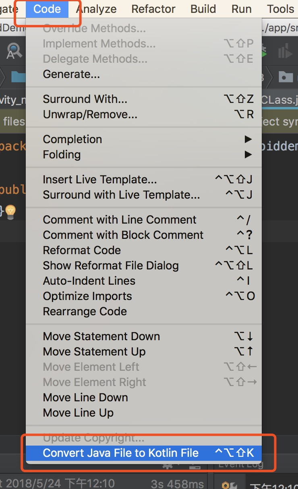
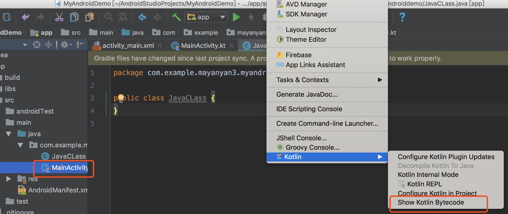
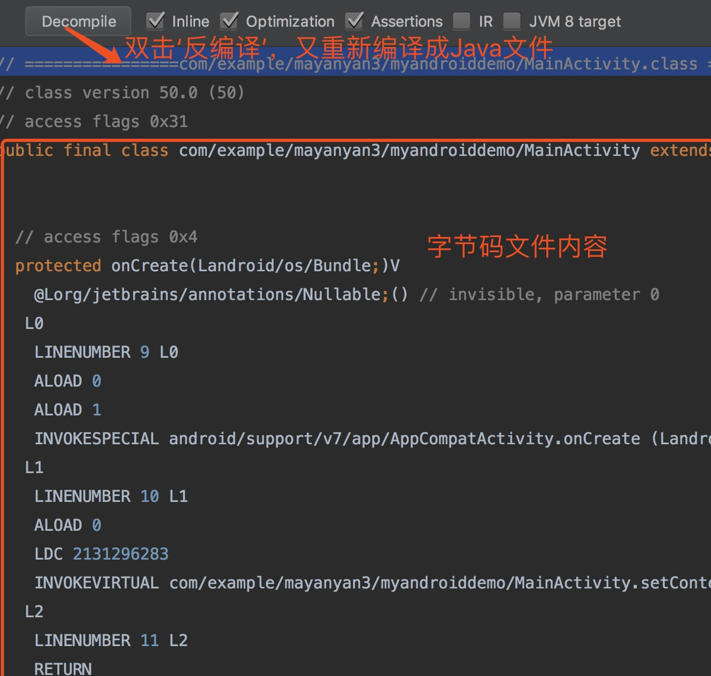
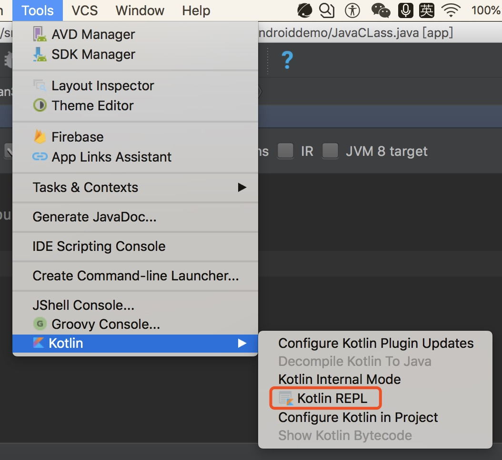
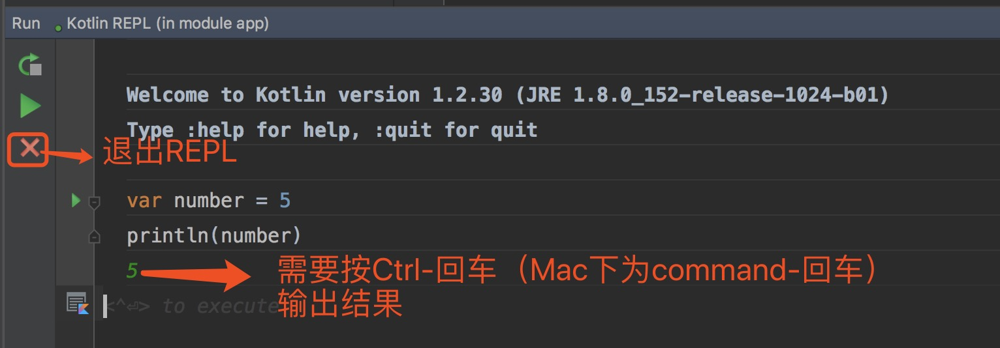

# Kotlin是什么？

Kotlin是由JetBrains创建的基于JVM的编程语言，Intellij正是JetBrains的杰作，而Android Studio是基于Intellij修改而来的。Kotlin是一门包含很多函数式编程思想的面向对象编程语言。

Kotlin是为了弥补Java缺失的现代语言的特性，并极大地简化了代码，使得开发者可以编写尽量少的样板代码

# 为什么要使用Kotlin？
Kotlin 是一门非常棒的现代编程语言。它与 Java 的可互操作性使我们可以同时使用两者混合编程，Kotlin 保持与现有基于 Java 的技术栈的完全兼容性，它可以用作服务端开发。Kotlin 也非常适合开发 Android 应用程序，将现代语言的所有优势带入 Android 平台而不会引入任何新的限制，Google 在2017年 Google I/O 大会上宣布 Kotlin 成为 Android 官方开发语言。Kotlin 提供了 JavaScript 作为目标平台的能力，支持构建基于浏览器的应用。Kotlin/Native 技术支持将Kotlin编译为原生二进制文件，目前支持Windows、Linux、MacOS、iOS、Android、WebAssembly平台，可以预见 Kotlin/Native 将会支持我们实现“一次编写、到处编译”的梦想。得益于 JetBrains，Kotlin 有很棒的 IDE 支持及很多的学习资料。对于 Java 开发人员 Kotlin 入门很容易。

Kotlin 非常适合开发 Android 应用程序，将现代语言的所有优势带入 Android 平台而不会引入任何新的限制：
+ 兼容性：Kotlin 与 JDK 6 完全兼容，保障了 Kotlin 应用程序可以在较旧的 Android 设备上运行而无任何问题。Kotlin 工具在 Android Studio 中会完全支持，并且兼容 Android 构建系统。
+ 性能：由于非常相似的字节码结构，Kotlin 应用程序的运行速度与 Java 类似。 随着
Kotlin 对内联函数的支持，使用 lambda 表达式的代码通常比用 Java 写的代码运行得更
快。
+ 互操作性：Kotlin 可与 Java 进行 100％ 的互操作，允许在 Kotlin 应用程序中使用所有现有的 Android 库 。这包括注解处理，所以数据绑定和 Dagger 也是一样。
+ 占用：Kotlin 具有非常紧凑的运行时库，可以通过使用 ProGuard 进一步减少。 在实际
应用程序中，Kotlin 运行时只增加几百个方法以及 .apk 文件不到 100K 大小。
+ 编译时长：Kotlin 支持高效的增量编译，所以对于清理构建会有额外的开销，增量构建通
常与 Java 一样快或者更快。
+ 学习曲线：对于 Java 开发人员，Kotlin 入门很容易。包含在 Kotlin 插件中的自动 Java到 Kotlin 的转换器有助于迈出第一步。Kotlin 心印 通过一系列互动练习提供了语言主要功能的指南。

# Kotlin快速使用

## 准备工作

帮助你搭建开发环境，为编码做准备

### Android Studio

安装Android Studio，这是Android官方的IDE。Android Studio是Intellij IDEA的插件实现，Intellij IDEA是有JetBrains开发的，Kotlin就是JetBrains。所以为了更为简单的Kotlin开发环境的搭建，这里强烈建议使用 **Android Studio 3.0及以上版本**。

### 安装Kotlin插件

因为从Intellij 15开始，插件是默认安装的，但是低于Android Studio 3.0 并没有，所以需要进入Android Studio的plugin，安装Kotlin插件。这里还是介绍下Kotlin插件安装方法：**Android->setting->选择‘plugins’->Browse repositories->搜索'kotlin'->点击“install”，然后重启Android Studio即可**。

kotlin插件安装成功的标志：如下




现在环境已经可以理解Kotlin语言了，就像我们使用Java一样无缝地编译执行Kotlin

## 创建一个新的项目

首先打开Android Studio，点击'新建项目'然后按照要求输入项目名称,选中‘include Kotlin support’，如下图所示：



之后一直点击‘Next’，知道’finish’完成继续创建项目

## 在应用的build.gradle文件中添加Kotlin插件依赖

Kotlin插件包括一个让我们配置的额Gradle的工具。按照上面所述方法新建Kotlin项目后build.gradle会默认帮我们配置好，这里，我们进行熟悉下

```Groovy
buildscript {
    ext.kotlin_version = '1.2.30'
    ext.anko_version = '0.10.1'
    repositories {
        google()
        jcenter()
    }
    dependencies {
        classpath 'com.android.tools.build:gradle:3.1.2'
        classpath "org.jetbrains.kotlin:kotlin-gradle-plugin:$kotlin_version" //Kotlin插件的dependency
    }
}

allprojects {
    repositories {
        google()
        jcenter()
    }
}
```

如你看到的一样，这里使用ext创建一个变量来存储Kotlin版本，第二个参数是用来存储Anko版本，用这种方式可以方便的控制Kotlin和Anko版本。

Anko是一个用来简化一些Android任务的很强大的Kotlin库，我们之后将会介绍Anko

## 将Java activity转换为kotlin文件

Kotlin plugin包含了一些有趣的特性，他能把Java代码转码成Kotlin代码。即将现有的Java项目迁移到Kotlin项目，因为很可能我们在同一个项目中同时使用Java和Kotlin，便可以通过这种特性进行转换

+ 第一种方法：

将Java代码拷贝，复制到剪切板，然后粘贴到Kotlin文件中，系统会提示如下：



点击“Yes”即可

+ 第二种方法：

选中Java文件，点击Android Studio上code按钮，选择'Converter java File to Kotlin File'，如下图所示：



<font color = red>第一种方法是基于第二种方法的，强烈建议使用第二种方法</font>


## 对findViewById说再见
也许你已经厌倦日复一日的使用findViewById编写Android视图，或者你可能放弃它转而使用著名的Butterknife库，那么你将会更加喜欢Kotlin的Android扩展——Kotlin Android Extensions

Kotlin Android Extensions是一种让开发更加简单的插件。当前仅仅包括了view的绑定，这个插件让我们直接访问XML中的View。这些 **属性的名字** 就是对应于 **view的id** 所以我们命名id时要小心，因为它将会是我们类中非常重要的一部分。

Kotlin Android Extensions 的一个优点是它不需要我们在代码中依赖其他额外的库。仅仅由插件组成，需要时用于生成工作所需的代码，只需要依赖于Kotlin的标准库


### Kotlin Android Extensions使用

我们在创建项目是，就已经在build.gradle中增加了这个依赖

```groovy
buldscript{
  repositories {
    jcenter()
  }
  dependencies {
    classpath "org.jetbrains.kotlin:kotlin-android-extension
    s:$kotlin_version"
  }
}
```

在我们使用view时，直接使用xml中id的名字，会自动导入引用，import语句以 **kotlin.android.synthetic** 开头，然后加上我们需要绑定到Activity的布局 **xml名字** ,例如：

### Activity的Android Extensions

```kotlin
import kotlin.android.synthetic.activity_main.*
```

此后，就可以在setContentView被调用后访问这些view


### Views的Android Extensions

一个view或者一个adapter唯一与Activity不同就是import语句，需要做的就是手动添加依赖 **import** 来使用它

```kotlin
import kotlinx.android.synthetic.view_item.view.*
```

## 测试是否一切就绪

在编写Hello Word程序，并运行。

+ 打开activity_main.xml,设置一个TextView的id

```xml
<TextView
    android:id="@+id/message"
    android:text="@string/hello_world"
    android:layout_width="wrap_content"
    android:layout_height="wrap_content"/>
```

+ Activity的onCreate()，访问这个TextView

```kotlin
override fun onCreate(savedInstanceState: Bundle?) {
    super.onCreate(savedInstanceState)
    setContentView(R.layout.activity_main)
    message.text = "Hello Kotlin!" //由于Kotlin Android Extensions这个功能，这里不用再使用findViewbyId
}

```

+ manifest.xml文件中声明MainActivity作为入口类，链接模拟器，点击run，便完成了一个简单的‘Hello Word’
App创建运行


## Kotlin到Bytecode到Java

在我们开始使用Kotlin语法进行编程时，有些编程方式可能会让你很疑惑，比如‘空安全’等内容，我们就想看看，这段代码用Java如何实现的，那么就会用到Show Kotlin Bytecode 这个插件功能，这个插件也有利于我们理解Kotlin编程方式


下面介绍使用Android Studio功能如何查看字节码文件：



然后便弹出”Kotlin Bytecode” 可以查看字节码文件，具体界面如下：




## 运行Kotlin代码的另一种方式

Android Studio提供了一种替代方法运行Kotlin代码，而不需要运行Android应用程序。当你需要快速的测试一些Kotlin代码是，这是非常有用的，这与Android的长期编译和部署是分开的。

这种方法就是使用 **REPL(Read Eval Print Loop)** ,REPL是一种简单的shell语言，它读取单个用户输入，计算并打印结果
。REPL看起来像命令行，但它将为我们提供所需的全部代码提示和将给我们访问各种项目中定义的结构。

运行界面如下所示：






# 总结
鉴于Kotlin有如此多好处，你准备好加入Kotlin学习行列了么！！后期会有一系列Kotlin常用基础语法介绍，例如，Kotlin空安全、Anko、扩展、Lambda表达式、高阶函数、DSL等等内容，敬请期待。
