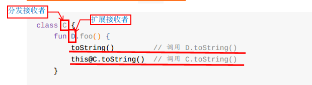

# kotlin类与对象三
本次课程所包含的内容如下:
- Kotlin可见修饰符
- 委托及委托属性、延迟属性、可观察属性
- Kotlin扩展
- Kotlin中对象表达式、对象声名、伴生对象

# 可见修饰符
类、对象、接口、构造函数、方法、属性及其setter都可以使用可见修饰符(getter总是跟属性有相同的可见性)。Kotlin中有四种可见性修饰符：private、protected、internal和public。Kotlin中默认的可见性修饰符是public。

以下解释这些可见性修饰符如何应用到不同类型的声明作用域。

## 包
函数、属性和类、对象、接口可以在顶层进行声明，即直接在包内：

```
//文件名：example.kt
package foo

fun baz(){} //函数
class Bar{} //类
```

+ 如果未指定任何修饰符，默认为public，意味着声明随处可见
+ 如果声明为private，则只会在声明它的文件内可见
+ 如果声明为internal，会在相同的模块(module)内随处可见
+ protected不适用于顶层声明（因为顶层声明不属于任何一个类，属于全局共享区域和方法，类似于Java中工具类和常量类）

>注意：要使用另一个包内的顶层声明，仍需要将其导入进来

```
//文件名example.kt
package foo
private fun foo(){} // 在example.kt 内可见

public var bar:Int = 5 //该属性随处可见
    private set     //setter 只在example.kt内可见

internal val baz = 6   //相同模块(module)可见
```

## 类与接口
对于类内部声明成员：
+ private——只在类内部(包含其所有成员)可见
+ protected—— 和private一样 + 在子类中可见
+ internal——在类声明的本模块的任何客户端都可见去internal成员
+ public——能见到类声明的任何客户端都可见

> 注意：对于Java用户：Kotlin中外部类不能访问内部类的private成员。</br>
如果覆盖一个protected成员并且没有显示指定其可见性，该成员还是protected可见性

```
open class Outer {
        private val a = 1
        protected open val b = 2
        internal val c = 3
        val d = 4 // 默认 public
        protected class Nested {
            public val e: Int = 5
        }
    }
    class Subclass : Outer() {
        // a 不可见
        // b、c、d 可见
        // Nested 和 e 可见
        override val b = 5 // “b”为 protected
    }
    class Unrelated(o: Outer) {
        // o.a、o.b 不可见
        // o.c 和 o.d 可见（相同模块）
        // Outer.Nested 不可见，Nested::e 也不可见
    }
```

## 构造函数
要指定一个类的主构造函数的可见性，可以使用以下语法
>注意：需要添加一个显示的constructor关键字

```
class C private constructor(a:Int){……}
```

这里的主构造函数是是私有的。默认情况下，所有的构造函数都是public，这实际等于类可见的地方它都可见(即一个internal类的构造函数只能在相同模块内可见)

## 局部声明
局部变量、函数、类不能有可见性修饰符

# 委托
委托模式是软件设计模式中一项基本技巧。在委托模式中，有两个对象参与处理同一个请求，接受请求的对象将对象委托给另一个对象来处理。</br>
Kotlin直接支持委托模式，更加简洁。通过关键字by实现委托.

## 类委托
类的委托即一个类中定义的方法实际是调用另一个类的对象的方法来实现。以下实例中类Derived可以继承一个接口Base，并将其所有共有的方法委托给一个指定的对象：

```java
//创建接口
interface Base{
    fun print();
}
//实现接口
class BaseImpl(val x: Int) : Base{
    override fun print() {
        print(x)
    }
}
//通过关键字by建立委托类
class Derived (b:Base): Base by b

fun main(args: Array<String>) {
    val b = BaseImpl(10)
    Derived(b).print() // 输出 10
}
```

Derived的超类型列表的 by-子句 表示b将会在Derived中内部存储。并且编译器会将生成转发给b所有Base的方法。

## 覆盖由委托实现的接口成员
方法覆盖会以你所希望的方式工作：编译器会使用你的override实现取代委托对象中的实现。如果Derived添加override fun print(){print("abc")},该程序输出的是"abc"而不是10

>注意：以这种方式重写的成员不会在委托对象的成员中使用，委托对象的成员只能访问其自身对接口的实现

```java
fun main(args: Array<String>) {
    val b = BaseImpl(10)
    val derived = Derived(b)
    derived.printMessage()
    println()
    derived.printMessageLine()
    println(derived.message)
}

interface Base {
    val message: String
    fun printMessage()
    fun printMessageLine()
}

class BaseImpl(val x: Int) : Base {
    override val message = "BaseImpl: x = $x"
    override fun printMessage() { print(x) }
    override fun printMessageLine() { println(x) }
}

class Derived(b: Base) : Base by b {
    // 在 b 的 `print` 实现中不会访问到这个属性
    override val message = "Message of Derived"
    override fun printMessage() { print("abc") }
}
```

## 委托属性
有一些常见的属性，虽然我们可以在每次使用的时候的侯东实现它们，但是如果能够把它们只实现一次然后放入一个库会更好。例如包括：
+ 延迟属性（lazy properties）：其值只在首次访问时计算
+ 可观察属性（observable properties）：监听器会收到有关此属性改变的通知
+ 把多个属性储存在一个map中，而不是每个存在单独的字段中。

为了涵盖这些（以及其他）情况，Kotlin支持委托属性。

属性委托指的是一个类的某个属性值不是在类中直接定义，而是将其委托给一个代理，从而实现了类的属性的统一管理。

属性委托的语法格式：

```
val/var <属性名> ：<类型> by <表达式>
```

val/var :属性类型</br>
属性名：属性的名称</br>
类型：属性的数据类型</br>
表达式：委托代理类</br>

by关键字后的表达式就是委托，属性的getter/setter将被委托给这个对象的getValue()和setValue()方法。属性委托不必实现任何接口，但必须提供getValue()方法，对于var属性，还需要setValue()方法
例如：
```
fun main(args: Array<String>) {
 val e = Example();
    println(e.p) // 访问该属性，调用 getValue() 函数
    e.p = "NAME"  //若p是var 调用 setValue() 函数
}
// 定义包含属性委托的类
class Example{
    val p :String by Delegate()
}
// 委托的类
class Delegate {
    operator fun getValue(thisRef: Any?, property: KProperty<*>): String {
        return "$thisRef, thank you for delegating '${property.name}' to me!"
    }
    operator fun setValue(thisRef: Any?, property: KProperty<*>, value: String) {
        println("$value has been assigned to '${property.name}' in $thisRef.")
    }
}
```

输出结果：

```
Example@4d405ef7, thank you for delegating 'p' to me!
NAME has been assigned to 'p' in Example@4d405ef7.
```

## 标准委托
Kotlin标准库为几种有用的委托提供了工厂方法
### 延迟委托 Lazy
lazy()是接受一个Lambda并返回一个Lazy<T>实例的函数，返回的实例可以作为实现延迟属性的委托：第一次调用get()会执行已传递给lazy()的lambda表达式并记录结果，后续调用get()只是返回记录的结果。

```
/**
 * 延迟属性
 * lazy（）接受一个Lambda返回一个Lazy<T>实例，这个实例可以作为延迟属性的委托
 */
val lazyValue:String by lazy {
    println("第一次调用")
    "Hello"
}

fun main(args: Array<String>) {
    println(lazyValue)
    println(lazyValue)
    println(lazyValue)
}

```

输出结果：

```
第一次调用
Hello
Hello
Hello
```

默认情况下，对于lazy属性的求值是同步锁的(synchronized)：该值只在一个线程中计算，并且所有线程都会看到相同的值。

如果初始化委托的同步锁不是必须的，这样多个线程可以同时执行，那么将LazyThreadSatetyMode.PUBLICACTION作为参数传递给lazy()函数。

而如果你确定初始化将总是发生在单个线程，那么你可以使用LazyThreadSafetyMode.NONE模式，它不会有任何线程安全的保证和相关的开销

### 可观察属性 Observable
Delegates.observable()接受两个参数：初始值和修改时处理程序(Handler)。每当给属性赋值后会调用该处理程序(在赋值后执行)。它有三个参数：被赋值的属性、旧值和新值

```
/**
 * 可观察属性Delegates.observable
 */
class User {
    var name :String by Delegates.observable("Lynn"){
        prop , old , new->
        println("$old-->$new")
    }
}

fun main(args: Array<String>) {
    var user = User()
    println(user.name)
    user.name = "First"
    println(user.name)
    user.name = "Second"
    println(user.name)
}
```

输出结果：

```
Lynn
Lynn-->First
First
First-->Second
Second
```

如果你想能够截获一个赋值并“否决”它，就使用vetoable()取代observable()。vetoable接收两个参数，第一个参数是初始值，第二个参数是变量改变前调用的lambda函数，如果lambda返回false，则变量不会被修改

```
class User{
    var name:String by Delegates.vetoable("Lynnma"){
        prop,old,new ->
        println("$old-->$new")
        false
    }
}
```

main()不变，则输出结果：

```
Lynnma
Lynnma-->First
Lynnma
Lynnma-->Second
Lynnma
```

### 把属性储存在映射中
一个常见的用例是在一个映射(map)里存储属性的值。经常出现在JSON解析和其他"动态"事情的应用中。可以使用映射实例自身作为委托来实现委托属性

```
/**
 * 映射自身作为委托实现委托属性
 */
class Persion (val map:Map<String,Any?>){
    //使用val是因为Map是只读的，MutableMap是可读写的，所以这里若要声明var属性，则需要使用MutableMap
    val name : String by map
    val age : Int by map
}
fun main(args: Array<String>) {
    //映射自身作为委托实现委托属性
    val persion = Persion(mapOf("name" to "Lynn","age" to 18))
    println(persion.name)
    println(persion.age)
}
```

### 局部委托属性
自Kotlin 1.11起，可以将局部变量声明为委托属性，例如，可以使一个局部变量惰性初始化

```
fun example(computeFoo: () -> Foo) {
    //memoizedFoo 变量只会在第一次访问时计算。 如果 someCondition 失败，那么该变量根本不会计算。
    val memoizedFoo by lazy(computeFoo)
    if (someCondition && memoizedFoo.isValid()) {
        memoizedFoo.doSomething()
    }
}
```

### 委托要求
这里总结了委托对象的要求:
+ 对于一个只读属性(val声明的)，委托必须提供一个名为getValue()的函数，该函数提供一下参数：
  - thisRef——必须与属性所有者类型（对于扩展属性——指被扩展的类型）相同或者是它的超类型
  - property——必须是类型KProperty< * > 或其超类型
 这个函数必须返回与属性相同的类型（或其子类型）
+ 对于一个可变属性(var声明的)，委托必须额外提供一个名为setValue(),该函数接受以下参数：
  - thisRef——同getValue()
  - property——同getValue()
  - new value——必须和属性同类型或是其超类型
+ getValue(),setValue()函数可以通过委托类的成员函数提供或者是由扩展函数提供。两个函数都需要operator关键字来进行标记
+ 委托类可以实现包含所需operator方法的ReadOnlyProperty或ReadWriteProperty接口之一，这两个接口是在Kotlin标准库中声明的

# Kotlin扩展
Kotlin同C#和Gosu类似，无需继承该类，也不必使用任何设计模式，就可以扩展一个类的新功能，这就叫扩展。Kotlin支持扩展函数和扩展属性

## 扩展函数
声明一个扩展函数，需要用一个接收者类型（也就是被扩展的类型）作为前缀，例如,为MutableList<Int>扩展一个swip函数:
```
fun main(args: Array<String>) {
    var list = mutableListOf<Int>(1,2,3,4,5)
    print("交换之前：")
    list.forEach {
        print(" $it")
    }
    //可以对任何MutableList对象调用swip()
    list.swip(0,2)
    print("交换之后：")
    list.forEach {
        print(" $it")
    }
}

fun MutableList<Int>.swip (index1:Int , index2:Int){
    //这里的this对应着接收者对象，(传过来的在"."之前的对象)
    var temp = this[index1]
    this[index1] = this[index2]
    this[index2] = temp
}
```

输出结果：

```
交换之前： 1 2 3 4 5交换之后： 3 2 1 4 5
```

为了使swip()对任何MutableList<T>起作用，我们可以泛化它

```
fun <T> MutableList<T>.swip (index1:Int , index2:Int){
    //这里的this对应着接收者对象，(传过来的在"."之前的对象)
    var temp = this[index1]
    this[index1] = this[index2]
    this[index2] = temp
}
```

## 扩展是静态解析的
扩展不能真正的修改他们所扩展的类。通过定义一个扩展，并没有在类中插入新成员，仅仅是可以通过该类型的实例可以调用这个新函数。<br/>
扩展函数是静态分发的，即他们不是根据接收者类型的虚方法。这意味着调用扩展函数是由函数调用所在表达式的类型来决定的，不是由表达式运行时求值决定的。

```
open class C
class D : C()
fun C.foo() = "C"
fun D.foo() = "D"
fun fooPrint(c:C){
    println(c.foo())
}
fun main(args: Array<String>) {
    //2.扩展是静态解析的
    fooPrint(C())
    fooPrint(D())
}
```

这个例子输出结果："C",因为调用的扩展函数只取决于参数c的声明类型，该类型是C类

>注意：如果一个类定义一个成员函数和一个扩展函数，而这两个函数有相同的接受这类型、相同的名字、相同的参数，这种情况下总是优先使用成员函数

```
open class C{
    fun foo():String{
       return "Native C"
    }
}
class D : C()
fun C.foo() = "C"
fun D.foo() = "D"
fun fooPrint(c:C){
    println(c.foo())
}
```

输出结果："Native C"

## 可空接收者
可以为可空的接收者定义扩展，这样的扩展可以在对象变量上调用，即使其值为null

## 扩展属性
和函数一样，Kotlin支持扩展属性
>注意：由于扩展没有实际的将成员插入类中，因此对扩展属性来说幕后字段是无效的。这也就是为什么扩展属性不能有初始化器。他们的行为只能由显示提供的getter/setter定义

```
val Foo.bar = 1 //错误：扩展属性不能有初始化器
var C.name:String
   get() = "Lynn"
   set(value) {name = value}
```

## 伴生对象的扩展
伴生对象也可以定义扩展函数和属性

```
/**
 * 伴生对象
 */
class Myclass{
    companion object {
    }
}

//伴生对象扩展函数
fun Myclass.Companion.func(){
    println("这是伴生对象扩展函数")
}
//伴生对象扩展属性
val Myclass.Companion.name :String
    get() = "Lynnma"
fun main(args: Array<String>) {
    Myclass.func()
    println(Myclass.name)
}
```

## 扩展作用域
+ 官方建议在顶层定义扩展，使用其他包里扩展需要在调用方导入它
+ 也可以在类内为该类或是其他类定义扩展，类内的扩展，无论是该类的扩展还是其他类的扩展，作用域仅局限于该类、该类的子类和内部类，其他类或是该类的嵌套类均不能访问。

```
class Functions constructor(var name:String){    
      fun Functions.clean(){
        this.name = ""
      }
      fun Person.study2(){
        print("start study")
      }
}
以上代码不仅对Functions类进行函数扩展，也同样对Person进行了函数扩展。
```
## 扩展声明为成员
在类内为该类或是其他类定义扩展。在这样的扩展中，有两个名词：分发接收者、扩展接收者

+ 扩展声明所在的类的实例——分发接收者
+ 扩展方法调用所在的接收者类型的实例——扩展接收者

 当分发接收者和扩展接收者的成员名字冲突时，以扩展接收者优先，要引用分发接收者的成员可以使用限定this语法
 
 在C类内，创建了D类的扩展，此时，C被称为分发接收者，D为扩展接收者
+ 声明为成员的扩展可以声明为open并在子类中覆盖。这意味着这些函数对于分发接收者时虚拟的，对于扩展接收者时静态的。

```
fun main(args: Array<String>) {
    B().caller(A()) // 输出 A.foo in B
    B1().caller(A()) // 输出 A.foo in B1 —— 分发接收者虚拟解析
    B().caller(A1()) // 输出 A.foo in B —— 扩展接收者静态解析
}
 open class A{}
 class A1 : A(){
}

 open class B {
     open fun A.foo(){
         println("A.foo in B")
    }

     open fun A1.foo(){
         println("A1.foo in B")
    }

     fun caller (a: A){
        a.foo()
    }
}

private class B1 : B() {
    override fun A.foo(){
        println("A.foo in B1")
    }

    override fun A1.foo() {
        println("A1.foo in B1")
    }
}
```

# 对象表达式、对象声名、伴生对象
有时，我们需要创建一个对某个类做了轻微改动的类的对象，而不用为之显示声明新类。Java用匿名内部类处理这种情况。Kotlin用对象表达式和对象声明。

## 对象表达式
创建一个继承自某个(某些)类型的匿名类对象，我们可以这样写：

```
window.addMouseListener(object : MouseAdapter() {
        override fun mouseClicked(e: MouseEvent) {
            // ……
        }
        override fun mouseEntered(e: MouseEvent) {
            // ……
        }
})
```

+ 如果超类型有一个构造函数，则必须传递适当构造函数参数给它
+ 多个超类型之间可用逗号（，）隔开
+ 如果只需要"一个对象"，并不需要特殊超类型，可以简单地写：

```
fun foo() {
    val adHoc = object {
        var x: Int = 0
        var y: Int = 0
    }
    print(adHoc.x + adHoc.y)
}
```

>注意：匿名对象可以用于本地和私有作用域中声明的类型。如果使用匿名对象作为公有函数的返回类型或者作为公有属性的类型，那么该函数或是属性的实际类型会是匿名对象声明的超类型，如果你没有声明任何超类型，就会是Any。在匿名对象中添加的成员将无法被访问

```
class ObjectClass {
    // 私有函数，所以其返回类型是匿名对象类型
    private fun foo() = object {
        val s :String = "privateFoo"
    }
    // 公有函数，所以其返回类型是 Any
    fun publicFoo() = object {
        val s:String = "publicFoo"
    }

    fun bar(){
        val x1 = foo().s    // 没问题
        val x2 = publicFoo().s  // 错误：未能解析的引用s
    }
}
```

+ 像Java匿名内部类一样，对象表达式中代码可以访问来自包含它的作用域的变量，与Java不同的时，这不仅限于final变量

```
fun countClicks(window: JComponent) {
    var clickCount = 0
    var enterCount = 0
    window.addMouseListener(object : MouseAdapter() {
        override fun mouseClicked(e: MouseEvent) {
            clickCount++  //Java 中clickCount必须使用final修饰才可以访问
        }
        override fun mouseEntered(e: MouseEvent) {
            enterCount++  //Java 中enterCount必须使用final修饰才可以访问
        }
    })
// ……
}
```

## 对象声明
 对象声明其实就是Java中的单利模式。

```
object DataProviderManager {
    fun registerDataProvider(provider: DataProvider) {
      // ……
    }
    val allDataProviders: Collection<DataProvider>
       get() = // ……
}
```

+ **语法：object+名称**，就像变量声明一样。
+ 对象声明不是一个表达式，不能用在赋值语句的右边。
+ 对象声明的初始化是线程安全的
+ 如需引用该对象，直接使用其名称即可

```
DataProviderManager.registerDataProvider(……)
```
+ 对象声明可以有超类型

```
object DefaultListener : MouseAdapter() {
    override fun mouseClicked(e: MouseEvent) {
        // ……
    }
    override fun mouseEntered(e: MouseEvent) {
        // ……
    }
}
```

>注意：对象声明不能在局部作用域(即直接嵌套在函数内部)，但是他们可以嵌套在其他对象声明中或是非内部类中

## 伴生对象
类内部的对象声明可以用companion关键字标记

```
//伴生对象完整表达方式，但是Factory也可以省掉
class MyClass {
    companion object Factory {
        fun create(): MyClass = MyClass()
    }
}
```

+ 伴生对象使用companion object修饰
+ 一个类只能有一个伴生对象
+ 一个类的伴生对象的引用默认为Companion
+ 可以像Java中使用静态方法和属性那样使用伴生对象的函数和属性，但是运行时，依旧是对象的实例的成员，还可以实现接口
+ 在JVM平台，使用@JvmStatic 注解，可以将伴生对象的成员生成真正的静态方法和字段

## 对象表达式和对象声明之间的语义差异
对象表达式和对象声明之间有一个重大的语义差别：
+ 对象表达式实在使用他们的地方立即初始化的
+ 对象声明是在第一次被访问到时延迟初始化的
+ 伴生对象的初始化是在相应的类被加载(解析)时，与Java静态初始化器的语义相匹配
