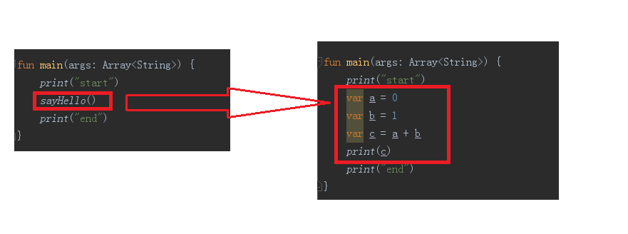
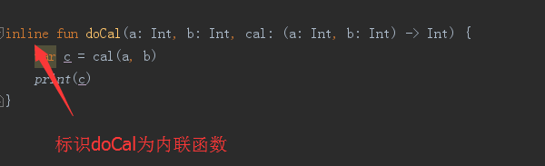
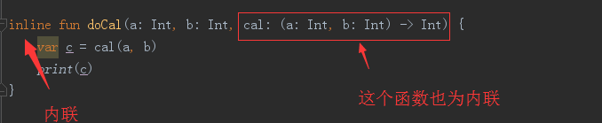
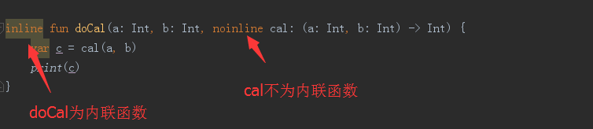

# Kotlin函数与Lambda表达式
  本节课程主要包括内容如下：
  + 函数
    - 函数声明
    - 函数用法
    - 函数参数
    - 中缀表示法——infix
    - 函数作用域
    - 各种函数类型，重点函数——高阶函数、Lambda表达式、匿名函数、内联函数
  + Lambda表达式、匿名函数
  + 高阶函数
  + 内联函数

## 函数声明

Kotlin中函数的一般写法

```java
fun double(x: Int): Int {
    return 2 * x
}
```

+ 函数需要使用  **fun** 关键字来声明
+ 参数的书写格式是：**标识符：类型** 和Java的参数命名方式较大不同
+ 返回值书写，Unit 相当于Java中void，在Kotlin中没有返回值时可以省略Unit

## 函数用法
调用函数使用传统的方法：

```java
val result = double(2)
```

调用成员函数使用 **点** 表示法：

```java
Sample().foo()   // 创建类 Sample 实例并调用 foo
```

###  参数

函数参数使用Pascal表示法定义，即 **name:type** ，每个参数用 **逗号** 隔开，每个参数必须有显示类型

####  默认参数

函数参数可以有默认值，当省略相应参数时使用默认值。与其他语言相比，这种方式可以减少方法重载数量

```java
fun read(b: Array<Byte>, off: Int = 0, len: Int = b.size) {
    //......
}
```

默认值通过类型后面的 **=  赋值** 来定义。

覆盖方法总是使用与基类型方法相同的默认参数值。当覆盖一个带有默认参数值的方法时，必须从签名中省略默认参数值：

```java
open class A {
    open fun foo(i: Int = 10) { ...... }
}
class B : A() {
    override fun foo(i: Int) { ...... } // 不能有默认值
}
```

如果一个默认参数在一个无默认值参数之前，那么默认值只能通过使用命名参数调用该函数来使用：

```java
fun foo(bar: Int = 0, baz: Int) { /* ...... */ }

fun main(args: Array<String>) {
    foo(baz = 1) // 使用默认值 bar = 0
}
```

不过如果最后一个Lambda表达式参数从括号外传给函数调用，那么允许默认参数不传值

```java
fun main(args: Array<String>) {
    foo(1) { // 使用默认值 baz = 1,bar重新赋值为1
        println("hello")
    }
    foo { // 使用两个默认值 bar = 0 与 baz = 1
        println("hello")
    }   class Sample() {
fun foo() { print("Foo") }
}
}

fun foo(bar: Int = 0, baz: Int = 1, qux: () -> Unit) {
    println("foo()中bar=$bar,baz=$baz")
}
```

输出结果：

```java
foo()中bar=1,baz=1
foo()中bar=0,baz=1
```

#### 命名参数

可以在调用函数时使用命名的函数参数。当一个函数有大量的参数或是默认参数时，这会很方便。给定以下函数:

```java
fun reformat(str: String,
             normalizeCase: Boolean = true,
             upperCaseFirstLetter: Boolean = true,
             divideByCamelHumps: Boolean = false,
             wordSeparator: Char = ' ') {
    ......
}
```

使用默认参数来调用：

```java
reformat(str)
```

然而，在使用非默认参数调用它时，调用起来就很累赘：

```java
reformat(str, true, true, false, '_')
```

所以，这时候我们使用命名参数来调用，可以具有更高的可读性,也更加方便

```java
reformat(str,
		normalizeCase = true,
		upperCaseFirstLetter = true,
		divideByCamelHumps = false,
		wordSeparator = '_'
)
```

并且如果我们不需要所有的参数：

```java
reformat(str, wordSeparator = '_')
```

>注意：当一个函数调用混用位置参数与命名参数时，所有位置参数都要放在第一个命名参数以前，例如，允许调用 f (1,y=2),但不允许 f (y=2,1)


#### 可变数量参数 vararg

+ 函数的参数(通常是最后一个)可以用vararg修饰符标记，如果vararg参数不是参数列表中最后一个参数，可以使用命名参数语法传递其后的参数的值。

```java
/**
 * ts是T类型的数组，相当于Array<out T>
 */
fun <T> asList(vararg ts: T): List<T> {
    val result = ArrayList<T>()
    for (t in ts) // ts is an Array
        result.add(t)
    return result
}
```

在函数内部，类型T的vararg参数的可见方式是作为 **T数组** ,上例中的 ts 是T类型的数组，相当于 **Array <out T>**

+ 只有一个参数可以标注为vararg，如果参数具有函数类型，则通过括号外部传一个Lambda表达式。

+ 可以通过使用伸展(`spread`)操作符（在数组前面加 ` 星号 ‘*’  `），将可变数量参数(vararg)以命名方式传入：

```java
fun foo(vararg strings: String) { /* ...... */ }
foo(strings = *arrayOf("a", "b", "c"))
```

>注意：在调用Java 函数时不能使用命名参数语法，因为Java字节码并不是保留函数参数的名称

### 中缀表示法
标有infix关键字的函数也可以使用`中缀表示法`(忽略该调用的`点和圆括号`)调用。中缀函数必须满足以下要求:
+ 他们必须是成员函数或是扩展函数
+ 它们必须只有一个参数
+ 其参数不得接受`可变数量的参数`且不能有默认值

```kotlin
infix fun Int.shl(x: Int): Int {
// ......
}
// 用中缀表示法调用该函数
1 shl 2
// 等同于这样
1.shl(2)
```

>1.中缀表达式优先级`低于` `算术运算符、类型转换以及rangTo操作符` <br/>
>2.中缀函数调用的优先级 `高于` `布尔操作符`（&&、||、is 、in等）<br/>
>3.中缀函数总是要求指定`接收者`与`参数`


### 函数作用域

在Kotlin中函数可以生命在文件顶层，这意味着不需要像Java、C#或Scale那样需要创建一个类来保存一个函数。此外除了顶层函数，Kotlin中函数也可以声明在局部作用域、作为成员函数以及扩展函数


## 单表达式函数

当函数返回单个表达式时，可以省略花括号并且的在 **=** 之后指定代码体即可：

```java
fun double(x: Int): Int = x * 2
```

当返回值类型可由编译器推断时，显示声明返回类型是可选的

```java
fun double(x: Int) = x * 2
```

## 块代码体函数

具有块代码体的函数必须始终显式指定返回类型，（除非他们返回Unit，这种情况下Unit是可选的）。Kotlin不推断具有块代码体的函数的返回值，因为这样的函数在代码体中可能有复杂的控制流，并且返回值对于读者（甚至对于编译器）都是不明显的

## 局部函数

Kotlin支持局部函数，即一个函数在另一个函数内部。

```java
fun dfs() {
    // 局部函数——在函数内部生命另一个函数
    fun <T> asList(vararg ts: T): List<T> {
        val result = ArrayList<T>()
        for (t in ts) // ts is an Array
            result.add(t)
        return result
    }
    //局部函数使用
    val a = arrayOf(1, 2, 3)
    val list = asList(-1, 0, *a, 4)
}
```

局部函数可以访问外部函数(即闭包)的局部变量，即 asList()可以访问函数dfs()里定义的局部变量

## 成员函数

成员函数是定义在类或是对象内部的函数。

```java
class Sample() {
    fun foo() { print("Foo") }
}
```

成员函数以 **点** 表示法进行调用：

```java
Sample().foo()  // 创建类 Sample 实例并调用 foo
```

关于类和覆盖函数的更多信息参见[类与继承](/overview/1.Kotlin概述与基础语法_v1.1.md)

## 泛型函数

函数可以有泛型参数，通过在函数名之前使用 **尖括号<>** 指定

```java
fun <T> singletonList(item: T): List<T> {
// ......
}
```

关于泛型函数更多信息参见[泛型](https://www.kotlincn.net/docs/reference/generics.html)，后面也会做泛型相关的总结，这里想要了解的先看下官网内容

## 扩展函数

关于扩展函数更多信息参见[扩展函数](/overview/4.Kotlin类与对象三.md)

## 高阶函数

高阶函数是将函数用作参数或是返回值的函数。这种函数最好的例子就是函数式风格的 fold，它接受一个初始积累值和一个接合函数，并通过将当前积累值与每个集合元素连续结合起来代入累积值来构建返回值。

```java
/**
 * 高阶函数——将函数用作参数或是返回值  的函数
 */
fun <T, R> Collection<T>.fold(
        initial: R,
        combine: (acc: R, nextElement: T) -> R
): R {
    var accumulator: R = initial
    for (element: T in this) {
        accumulator = combine(accumulator, element)
    }
    return accumulator
}
```

上述代码中，参数combine具有函数类型 (R,T)-> R,因此fold接受一个函数作为参数，该函数接受类型分别为R与T的两个参数并返回一个R类型的值。在for循环内部调用该函数，然后将其返回值赋值给accumulator<br/>
为了调用fold()需要传递给它一个函数类型的实例作为参数，而在高阶函数调用处Lambda表达式广泛用于此目的。

```java
    //高阶函数
    val items = listOf(1, 2, 3, 4, 5)
    // Lambdas 表达式是花括号括起来的代码块。
    items.fold(0, {
        // 如果一个 lambda 表达式有参数，前面是参数，后跟“->”
        acc: Int, i: Int ->
        print("acc = $acc, i = $i, ")
        val result = acc + i
        println("result = $result")
        // lambda 表达式中的最后一个表达式是返回值：
        result
    })
    // lambda 表达式的参数类型是可选的，如果能够推断出来的话：
    val joinedToString = items.fold("Elements:", { acc, i -> acc + " " + i })
    // 函数引用也可以用于高阶函数调用：
    val product = items.fold(1, Int::times)
```

调用高阶函数方法：
+ 用`函数引用`的形式把它传入高阶函数(fold()),这种方法适用于要执行的操作已有函数定义时
+ 使用`匿名函数或是Lambda表达式`传入所需参数

>注意：Kotlin中有一个约定，如果函数的最后一个参数是一个函数，并且你传递一个Lambda表达式作为相应的参数，你可以在圆括号之外指定它：


```java
 items.fold(0){
            // 如果一个 lambda 表达式有参数，前面是参数，后跟“->”
            acc: Int, i: Int ->
            print("acc = $acc, i = $i, ")
            val result = acc + i
            println("result = $result")
            // lambda 表达式中的最后一个表达式是返回值：
            result
    }  
```


> 注意：如果Lambda是调用的唯一参数，则调用中的圆括号可以完全省略


### 函数类型

一个函数要接受另一个函数作为参数，我们得给它指定一个类型，例如

```java
fun max<T>(collection: Collection<out T>, less: (T, T) -> Boolean): T? {
    var max: T? = null
    for (it in collection)
        if (max == null || less(max!!, it))
            max = it
    return max
}
```

参数 less 是 (T, T) -> Boolean类型，也就是接受俩个 T 类型参数返回一个 Boolean:如果第一个参数小于第二个则返回真。
这些类型具有与函数签名相对应的特殊表示法，即它们的参数和返回值：
 - 所有函数都有一个圆括号括起来的参数类型列表以及一个返回类型：**(A,B)->C**  表示接受类型分别为A与B两个参数并返回一个C类型的函数类型。参数列表为空表示：**()->C** 。

  <font color=red>C为Unit时，Unit返回类型不可以省略</font>


 - 带接收者的函数类型： **A.(B)->C** 函数表达式扩展

 >如需将函数类型指定为可空，请使用圆括号:((Int,Int)->Int)?

## Lambda表达式

一个Lambda表达式或是匿名函数是一个“函数字面值”，即一个未声明的函数，但立即作为表达式传递。考虑下面的例子：

```java
max(strings, { a, b -> a.length < b.length })
```

函数max是一个高阶函数，max函数的第二个参数是一个表达式，它本身是一个函数，即函数字面值，它相当于：

```java
fun compare(a: String, b: String): Boolean = a.length < b.length
```

Lambda表达式简述：
 + Lambda表达式总是括在花括号中
 + 其参数(如果有的话)在 -> 之前声明 (参数类型可以省略)
 + 函数体(如果存在的话)在 -> 后面
 + 如果推断出该Lambda表达式返回类型不是Unit，那么Lambda主体中最后一个表达式会视为返回值
 + 如果 Lambda 是函数调用的唯一参数,则调用中的圆括号可以省略
 + Kotlin中有一个约定，如果函数的最后一个参数是一个函数，并且你传递一个Lambda表达式作为相应的参数，你可以在圆括号之外指定它

### Lambda表达式语法

为了让大家彻底的弄明白Lambda语法，我这里用三种用法来讲解。并且举例为大家说明，语法如下：

+ 一. 无参数的情况 ：

```
 val/var 变量名 = { 操作的代码 }
 ```

+ 二. 有参数的情况：

```
   val/var 变量名 : (参数的类型，参数类型，...) -> 返回值类型 = {参数1，参数2，... -> 操作参数的代码 }
   ```

 可等价于

  ```
 // 此种写法：即表达式的返回值类型会根据操作的代码自推导出来。

 val/var 变量名 = { 参数1 ： 类型，参数2 : 类型, ... -> 操作参数的代码 }
 ```

+ 三. lambda表达式作为函数中的参数的时候，这里举一个例子：

```
 fun test(a : Int, 参数名 : (参数1 ： 类型，参数2 : 类型, ... ) -> 表达式返回类型){
    ...
 }
 ```

实例讲解：
+ 1.无参数情况——Lambda表达式

```
// 源代码
fun test(){ println("无参数") }
// lambda代码
val test = { println("无参数") }
// 调用
test()  // 结果为：无参数
```

+ 2.有参数的情况——这里举例一个两个参数的例子，目的只为大家演示

```
// 源代码
fun test(a : Int , b : Int) : Int{
    return a + b
}
// lambda
val test2 : (Int , Int) -> Int = {a , b -> a + b}
// 或者
val test22 = {a : Int , b : Int -> a + b}

// 调用
test(3,5) // 结果为：8
```

+ 3.lambda表达式作为函数中的参数的时候

```
//Lambda
fun sum (a:Int ,bool:(num1:Int,num2:Int)->Int):Int{
    //invoke()函数：表示为通过函数变量调用自身，因为上面例子中的变量b是一个匿名函数。
    return a+bool.invoke(3,5)
}
// 源代码
fun test(a : Int , b : Int) : Int{
    return a + b
}

fun sum(num1 : Int , num2 : Int) : Int{
    return num1 + num2
}
```

### it:单个参数的隐式名称

一个Lambda表达式只有一个参数是很常见的。如果Kotlin可以自己计算出签名，它允许我们不声明唯一的参数（连同->一快省略，只留Lambda表达式的函数体），并将隐含地为我们声明其名称为it

```java
ints.filter { it > 0 } // 这个字面值是“(it: Int) -> Boolean”类型的
```

## 匿名函数

上面提供的Lambda表达式语法缺少一个东西是指定函数的返回类型的能力。在大多数情况下是不必要的，因为返回类型可以自动推断出来。然后，如果确实需要显式指定，可以使用另一种语法：匿名函数

```java
fun(x:Int,y:Int):Int=x+y
```

匿名函数看起来非常像一个常规函数生命，除了其名称省略了。其函数体可以是表达式(如上所示)或是代码块：

```java
fun(x: Int, y: Int): Int {
    return x + y
}
```

匿名函数的返回类型推断机制与正常函数一样：对于具有表达式函数体的匿名函数将自动推断返回类型，而具有代码块函数体的返回类型必须显示指定(或者已经假设为Unit)

>注意：Lambda表达式与匿名函数区别：<br/>
>1.匿名函数参数总是在括号内传递。允许将函数留在圆括号外的简写语法仅适用与Lambda表达式。<br/><br/>
>2.匿名函数与Lambda表达式另一个区别是非局部返回的行为。一个不带标签的return语句总是在用 **fun关键字** 声明的函数中返回。意味着 **Lambda表达式中return+lable** 将从包含它的函数返回，而匿名函数中return将从匿名函数自身返回。

### 带接收者的函数类型

带接收者的函数类型： **A.(B)->C** 表示可以在 A 的接收者对象上以一个 B 类型参数来调用并返回一个 C 类型值的函数。它们最重要的使用是在 [类型安全的Groovy-风格构建器](http://kotlinlang.org/docs/reference/type-safe-builders.html)。

+ 匿名函数作为接收者类型

 匿名函数语法允许直接指定函数的接收者类型，如果使用带接收者的函数类型声明一个变量，并在之后使用它,这将非常有用。

```java
//匿名函数 指定接收者类型-Int
val sum = fun Int.(other: Int): Int = this + other
//调用
1.sum(1)  // 输出结果：2
```

+ Lambda表达式作为接收者类型

```Java
   class HTML {
        fun body() {
            println("HTML BODY")
        }
    }
    fun html(init: HTML.() -> Unit): HTML { // HTML.()中的HTML是接受者类型
        val html = HTML() // 创建接收者对象
        html.init() // 将该接收者对象传给该 lambda
        return html
    }
```

<font color=red>要用Lambda表达式作为接收者类型的前提是接收着类型可以从上下文中推断出来。</font>

### 闭包

Lambda表达式或匿名函数(以及局部函数和对象表达式)可以访问其闭包，即在外部作用域中声明的变量。与Java不同的是可以修改闭包中捕获的变量

```java
var sum = 0  //
ints.filter{it > 0}.forEach {
    sum += it
}
print(sum)
```

## 内联函数

1.在Kotlin中，函数就是对象，当你调用某个函数的时候，就会创建相关的对象。这就是空间上的开销<br/>

2.当调用某个函数的时候，虚拟机会去找到你的调用函数的位置，然后执行函数，然后返回到你调用的初始位置，这就是时间上的开销<br/>

3.如果，我直接把 **调用的函数里面的代码** 放到我调用的地方，省去寻找调用函数的位置的时间，这就是内联函数的由来

使用内联：

将fun syaHello()函数标识为内联函数inline fun syaHello(),你的代码就会变成如下模样：



### 定义内联函数

在函数前加入一个标识：**inline**  即可   



>注意：<br/>1. Kotlin中函数就是对象，我们可以将函数作为参数传递给对象，那么这个内联函数中使用的Lambda也默认为内联函数<br/>2.Kotlin并不建议将非高阶函数定义为内联函数。Kotlin编译器告诉我们，内联最好与有Lambda表达式参数的函数配合使用



### 禁用内联

内联可能导致生成的代码增加；不过如果使用得当(即避免内联过大函数)，性能上会有所提升。当然，也可以改变这种行为。如果你只想被（作为参数）传递给一个内联函数的Lambda表达式中，可以使用noinline修饰符标记一些函数参数



可以内联的Lambda表达式只能在内联函数内部调用或者作为内联函数的参数传递，但是noinline的可以以任何我们喜欢的方式操作：存储在字段中、传送它等等。

>注意：如果一个内联函数没有可内敛的函数参数并且没有具体化的类型参数(reified参数)，编译器会产生一个警告，因为内联这样的函数很可能并无益处,如果你确认需要内联，则可以使用@Suppress("NOTHING_TO_INLINE")注解关掉该警告

### return在内联函数中表现—非局部返回

在Kotlin中，return只能用在 **有名字函数或匿名函数** 中，使得该函数执行完毕，而对于Lambda表达式，不能直接使用return，可以使用return+label的形式，将这个Lambda结束

```java
    fun go(f:(Int)->Unit){
        var i = 0
        while(i<3){
            f(i)
            i++
        }
    }

    go label@{ if (it==1) return@label else println(it)} // 结果：0 2
```

但是在内联函数中的Lambda表达式，就可以在Lambda中使用return

```java
inline fun go(f:(Int)->Unit){
    var i = 0
    while(i<3){
        f(i)
        i++
    }
}
go { if (it==1) return else println(it)} // 结果：0
```

可以这么理解，内联函数在编译的时候，将相关的代码贴入调用的地方。Lambda表达式就是一段代码而已，这时候在Lambda中return，相当于你调用的方法内return

>注意 break和continue在内联Lambda表达式中还不可用，但是Kotlin计划支持

### 内联属性

对于属性来说，会有getter/setter访问器来操作这个属性，getter/setter访问器就可以标识为内联函数：

```java
val foo: Int
    inline get() = 2
var bar: Int
    get() = 3
    inline set(v) {  }
inline var baz :String
    get() = "Lynn"
    set(value)  { }
```

### 具体化的类型参数——reified
reified是 ` ‘具体的’` 意思，Kotlin中这个关键字只用来修饰 **泛型函数的类型参数，它要求这个内联函数在展开到调用时，必须有一个具体的类型来替换类型参数**
有这样一个例子：

```java
fun <T> TreeNode.findParentOfType(clazz: Class<T>): T? {
    var p = parent
    while (p != null && !clazz.isInstance(p)) {
        p = p.parent
    }
    @Suppress("UNCHECKED_CAST")
    return p as T?
}
```

使用方式：

```java
treeNode.findParentOfType(MyTreeNode::class.java)
```

但是这样写不优雅，我问期望这么使用：

```java
treeNode.findParentOfType<MyTreeNode>()
```

这时就需要使用到具体化的类型参数。内联函数支持具体的类型参数声明reified

```java
inline fun <reified T> TreeNode.findParentOfType(): T? {
    var p = parent
    while (p != null && p !is T) {
        p = p.parent
    }
    return p as T?
}
```

我们使用reified修饰符来限定类型参数，就可以在函数内部访问该参数，几乎就像一个普通的类一样。由于函数是内联的，不需要反射，正常的操作符如!is 和 as现在都可以使用

通过inline-reified组合使用，我们可以避免传递没有必要的Class参数，使用更加简单易懂的反省参数来调用函数

但是这里也有两个大坑：
+ reified关键字要求调用时必须使用具体的类型，不能使用泛型
+ 使用了reified关键字修饰的内联函数，不能在Java中调用

### 内联函数注解
+ kotlin.internal.@InlineOnly，用它修饰的内联函数只能用于内联形式的访问

### 总结

+ inline修饰符可用于没有幕后字段的属性的访问器，可以标注独立的属性访问器，也可以标注整个属性，将它的两个访问器都标记为内联

+ 在调用出，内联访问器如同内联函数一样内联
