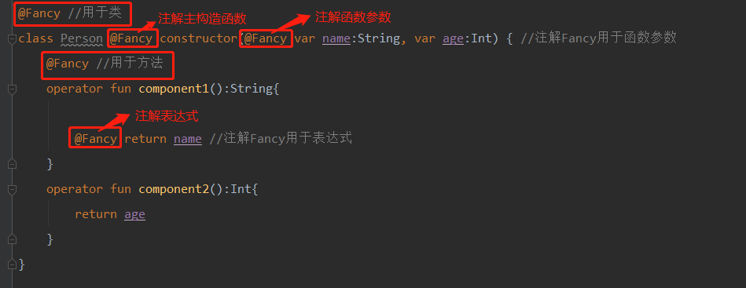
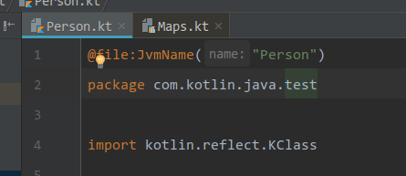

# Kotlin基础语法补充一

## 解构声明
把一个对象解构成很多变量，称为解构声明，例如：

```java
val (name, age) = Person
```

一个解构声明同时创建多个变量。其实已经声明了两个新的变量：name和age，并且可以独立使用它们

```java
println(name)
println(age)
```

一个解构函数会被编译成以下代码：

```java
val name = Person.component1()
val age = Person.component2()
```

其中的component1()和component2()函数是在Kotlin约定的操作符(类似于+ - * / for等操作符)。componentN是操作符(类似于加减乘除的运算符)，重载操作符必须要使用operator修饰以允许使用，解构声明componentN()定义如下：

```java
class Person(var name:String,var age:Int) {
	//componentN是操作符，重载它，必须添加operator修饰符
    operator fun component1():String{
        return name
    }
    operator fun component2():Int{
        return age
    }
}
```

### 数据类（data class）

编译器会为数据类（data class）自动声明/定义componentN（）函数，可直接用解构声明

```
data class User(val name: String, val id: Int)
val (name2,age2) = User("Lily",26)
```

### 函数返回多个变量(Return Valus)
如果需要一个函数返回多个变量，Kotlin最简洁的实现就是声明一个数据类并返回其实例对象，数据类(data class)自动声明/定义componentN()函数，无需自定义

```java
fun doCal():User{
	return User("Lilei",18)
}

val (name3,age3)=doCal()
```

### for循环-解构声明

```java
var persons = mutableListOf<Person>(Person("Lucy",16), Person("Lily",16), Person("Lilei",17))
for ((name,age) in persons){
	println("name=$name,age=$age")
}
```

### 映射Map-解构声明

```java
var map = mapOf<String,User>("one" to User("Lucy",16),"two" to User("Lily",16))
for((key,value) in map){
	val (name,age) = value
	println("key=$key,value.name=$name,value.age=$age")
}
```

直接可用解构声明，是因为：
+ Kotlin标准库提供了iterator()将map表示为一个值的序列
+ Kotlin标准库对Map提供了component1()和component2()类实现每个元素呈现为一对

```java
operator fun <K, V> Map<K, V>.iterator(): Iterator<Map.Entry<K, V>> = entrySet().iterator()
operator fun <K, V> Map.Entry<K, V>.component1() = getKey()
operator fun <K, V> Map.Entry<K, V>.component2() = getValue()
```

### 自Kotlin 1.1起的新特性

+ 下划线 **_** ——未使用变量

 如果在解构声明中不需要使用某个变量，可以用_取代

```
 data class User(val name: String, val id: Int)
 val (_,age2) = User("Lily",26)  //只是用age2这个变量
```
+ Lambda表达式参数解构

 如果Lambda表达式的参数类型是Pair/Map.Entry或具有componentN()的类型，那么Lambda表达式参数可以使用解构声明。

 多个参数和一个解构对的区别：
  - {a ->……}//一个参数
  - {a,b ->……} //两个参数
  - {(a,b) ->……}//一个结构对
  - {(a,b) ，c->……}//一个结构对，一个参数

```java
var map2 = mapOf<String,Int>("one" to 1,"two" to 2);
//(Map.Entry<K, V>) -> R Lambda表达式的函数类型
map2.mapValues { entry -> println("entry.key=${entry.key},entry.value=${entry.value}") }
map2.mapValues { (key,value) -> println("key=$key,value=$value")  }
```

1.解构的参数未使用，用下划线取代，一年编造新名：

```java
map.mapValues { (_, value) -> "$value!" }
```

2.可以指定解构的参数类型：

```java
map.mapValues { (_, value): Map.Entry<Int, String> -> "$value!" }
        map.mapValues { (_, value: String) -> "$value!" }
```

## 注解
注解是将元数据附加到代码的方法。使用注解可以写出更加简洁代码，同时还可以在编译期进行类型检查。Kotlin 的注解完全兼容 Java 的注解。

### 注解声明

要声明注解，使用annotation修饰符放在类的前面，如下所示：

```
 annotation class Fancy
```

注解的附加属性可以通过用元注解类来指定：
 + @target 指定可以用该注解标注的元素的可能的类型(类、函数、属性、表达式等)
 + @Retention 指定该注解是否存储在编译后的class文件中，以及它在运行是能否通过反射可见(默认为true)
 + @Repeatable 允许在单个元素上多次使用相同的该注解
 + @MustBeDocumented 指定该注解是共有API的一部分，并且应该包含在生成的API文档中显示类或是方法的签名中

下面声明一个Fancy的注解

```
/**
 *  AnnotationRetention.BINARY //存储在编译后的 Class 文件，但是反射不可见
    AnnotationRetention.RUNTIME //存储在编译后的 Class 文件，但是反射可见
 */
@Target(AnnotationTarget.CLASS, //用于类
        AnnotationTarget.FUNCTION, //用于表达式
        AnnotationTarget.VALUE_PARAMETER, //用于函数参数
        AnnotationTarget.EXPRESSION)//用于表达式
@Retention (AnnotationRetention.SOURCE)//表示注解只存在源码,不在编译后的class文件
@MustBeDocumented
annotation class Fancy
```

从这里看出注解也是一种class，编译器同样可以对注解类型在编译期进行类型检查。我们通过向注解类添加元注解的方法来指定其他属性

### 用法
+ 1.上面我们定义的一个Fancy注解可以用在类、方法、函数属性和表达式

```java
@Fancy //用于类
class Person(@Fancy var name:String, var age:Int) { //注解Fancy用于函数参数
    @Fancy //用于方法
    operator fun component1():String{

        @Fancy return name //注解Fancy用于表达式
    }
    operator fun component2():Int{
        return age
    }
}
```

+ 2.如果需要对类的主构造函数进行标注，则需要在主构造函数声明中添加constructor关键字，并将注解（<font color=red>该注解可以用于注解构造函数</font>）添加到期前面



+ 3.也属性访问器添加构造函数。
+ 4.Lambda表达式也可以使用注解
#### Lambda 表达式
注解也可以用于Lambda表达式。它们会被用于生成Lambda表达式体的invoke()方法上

```java 
val f = @Fancy{}
```

### 声明注解的构造函数
注解可以有接受参数的构造函数

```Java
/**
 * 声明携带参数的注解
 */
annotation class Special(val name:String)//注解里只能有val参数
//使用注解
@Special("example")
   operator fun component2():Int{
	   return age
   }
```

Kotlin注解允许的参数类型如下：
+ 对应于Java原生类型（Int、Long等）
+ 字符串
+ 类（Foo::class）
+ 枚举
+ 其他注解
+ 上面以列类型的数组

>注意：<br/>1.注解参数不能有可空类型，因为JVM不支持将null作为注解属性的值存储<br/>2.如果注解用作另一个注解的参数，则其名称不以@字符为前缀<br/>3.如果需要将一个类指定为注解的参数，使用Kotlin类（KClass），Kotlin编译器会自定将其转换为Java类，以便Java代码能够正常看到该注解和参数

```java
/**
 * 声明携带参数的注解
 */
annotation class Special(val name:String)//注解里只能有val参数

/**
 * 注解作为参数的注解,该参数,不需要加@前缀
 */
annotation class annotationSpecial(val peremeter:String,val special:Special = Special(""))

/**
 * 类作为注解参数
 */
annotation class ClassAnnotation(val kCLass : KClass<*>,val kClass2: KClass<out Any>)

//使用注解
@annotationSpecial("annotationSpecial", Special("Special"))
@ClassAnnotation(String::class,Int::class)
data class User(val name: String, val id: Int)
```

### 注解使用处目标/精确注解
当对属性或是主构造函数参数进行注解时，一个Kotlin属性元素会生成多个JAVA元素，说白了就是，主构造函数参数就是Kotlin属性，而【Kotlin属性】相当于【Java类field字段+get()+set()】,因此在Kotlin源码编译成Java字节码时，该注解可能同时在多个元素上！

+ 属性元素(set/get/field/param)进行精确注解

```java
annotation class Ann  //注解声明
//Ann是注解，@XX：是固定用法
class Example(@field:Ann val foo :String, //对Java 字段 进行注解
              @get:Ann val bar:String  ,    //对Java get方法 进行注解
              @param:Ann val quux:String)  //对Java 构造函数参数 进行注解
```

+ 同一目标元素有多个注解，可在方括号添加多个注解，空格分隔：

```java
 //name的set方法有两个注解Ann和Special("special")
@set:[Ann Special("special")] var name: String = "Lucy"
```

+ 使用相同语法注解整个文件，把@file注解放在文件的顶层(package指令之前)

 

+ 使用出目标的完成列表
  - @file：(注解整个文件)
  - @property:(具有此目标的注解对JAVA不可见)
  - @field:(字段注解)
  - @get:(属性的getter方法)
  - @set:(属性的setter方法)
  - @receiver:(扩展函数或是属性的接收者参数)
  - @param:(构造函数参数)
  - @setparam:(属性setter()参数)
  - @delegate:(为委托属性存储其委托实例对象的字段)

对于扩展函数的接收者参数进行注解，语法如下：

```java
fun @receiver:Ann String.foo(){}
```

+ 如果不指定使用处目标,则根据正在使用的注解的@Target注解来选择目标 。如果有多个适用的目标,则使用以下列表中的第一个适用目标:
  - param;
  - property
  - field

### Kotlin中使用Java注解
kotlin注解与Java注解100%兼容。

+ 因为Java声明的注解没有定义参数顺序，所以Kotlin需要使用命名参数来传递注解参数

```java
// Java代码,声明注解Ann
public @interface Ann {
    int intValue();
    String stringValue();
}

// Kotlin代码,命名参数传递注解参数
@Ann(intValue = 1, stringValue = "abc") class C
```

+ Java注解中，有一个特殊的value参数无需显式是定参数名：

```java
// Java
public @interface AnnWithValue {
    String value();
}
// Kotlin
@AnnWithValue("abc") class C
```

+ 如果注解的value参数类型是数组，那么在Kotlin中该参数类型就是vararg

```java
// Java
    public @interface AnnWithArrayValue {
        String[] value();
    }
    // Kotlin,参数类型是vararg(参数个数可变),相当于数组
    @AnnWithArrayValue("abc", "foo", "bar") class C
```

+ 如果Java注解的其他参数类型是数组，那么在Kotlin中该参数需要显式的使用arrayOf：

```java
// Java
public @interface AnnWithArrayMethod {
    String[] names();
}
// Kotlin 1.2+:
@AnnWithArrayMethod(names = ["abc", "foo", "bar"])
class C
// 旧版本 Kotlin:
@AnnWithArrayMethod(names = arrayOf("abc", "foo", "bar"))
class D
```

+ Java注解实例对象值会作为Kotlin属性，暴露给Kotlin代码

```java
// Java
    public @interface Ann {
        int value();
    }
    // Kotlin
    fun foo(ann: Ann) {
        val i = ann.value
    }
```

## 集合与区间
### 集合
跟大多数语言不同，Kotlin区分可变集合和不可变集合。精确控制什么时候可编辑有助于消除bug和设计良好的API。<br/>
Kotlin的List<out T>类型就是不可变的集合，提供只读操作如：size、get等接口。<br/>MutableList<T>是可读写的。<br/>
Kotlin没有构建list或是set。需要用标准库中方法，如：listOf()、mutableListOf()、setOf()、mutableSetOf（）。<br/>
对于不可变集合都是协变的(即假设:A是B的父类,表示为 A<|B，f(A) <| f(B) )，
举个例子List<Int>赋值给List<Number>

### 区间
区间表达式由具有操作符形式的 **...** 的rangto函数，辅以**in 和!in** 形成。区间是为任何比较类型定义的，但对于整型原生类型，它有一个优化的实现。一下是使用区间的一些示例：

```java
    if (i in 1..10) { // 等同于 1 <= i && i <= 10
        println(i)
    }
```

整型区间(IntRange、LongRange、CharRange)有一个额外的特性：<font color=red>它们可以迭代</font>。编译器负责将其转换为类似Java的基于索引的for-循环而没有额外开销

## This表达式

为了表示当前的接收者，我们使用This表达式：
+ 在类中的成员中，this指的是该类的当前对象
+ 在扩展函数或是带接收者的函数字面值(A.(B)->C)中，this表示在 **点** 左侧传递的接收者参数

如果this没有限定符，它指的是最内层的包含它的作用域。要引用其他作用域中的this，请使用 标签限定符

### 限定的this
要访问来自外部作用于的this(一个类或者扩展函数，或者带标签的带接收者的函数自面子)我们使用this@label，其中@label是一个代指this来源的标签：

```java
class A { // 隐式标签 @A
    inner class B { // 隐式标签 @B
        fun Int.foo() { // 隐式标签 @foo
            val a = this@A // A 的 this
            val b = this@B // B 的 this
            val c = this // foo() 的接收者,一个 Int
            val c1 = this@foo // foo() 的接收者,一个 Int
            val funLit = lambda@ fun String.() {
                val d = this // funLit 的接收者
            }
            val funLit2 = { s: String ->
                // foo() 的接收者,因为它包含的 lambda 表达式
                // 没有任何接收者
                val d1 = this
            }
        }
    }
}
```

## 相等性
Kotlin中有两种类型的相等性
+ 结构相等(用equals()检查)
+ 引用相等(两个引用指向同一个对象)

### 结构相等
结构相等由 ==（以及否定 ！=）操作符判断。按照惯例，像a==b这样的表达式会翻译成：

```java
/**
 * a不是null则调用equals(Any?) 函数，否则(即a==null)检查 b 是否与null引用相等
 * 注意：当与null显式比较时完全没必要优化你的代码：a==null会被自动转换为a===null
 */
a?.equals(b)?:(b===null)
```

### 引用相等
引用相等由===(以及否定形式 ！==)操作判断。

a===b当且仅当a和b指向同一个对象时求值为true。对于运行时表示为原生类型的值(例如Int)===相等检测等价于==检测
## 操作符重载
Kotlin允许我们自定义类型的运算符的实现，即运算符重载，这些运算符有固定的表示和固定的优先级。

### 支持重载的操作符类型
Kotlin语言支持重载的操作符类型比较多，目前支持重载的操作符可以归纳为以下几类：

#### 一元操作符
+ 一元前缀操作符

|操作符|对应方法|
|:---|:---|
|+a|a.unaryPlus()|
|-a|a.unaryMinus()|
|!a|a.not()|

以上三个操作符在日常使用中频率很高，第一个操作符在基本运算中很少使用，第二个操作符就是常见的取反操作，第三个操作符是逻辑取反操作。

+ 自增和自减操作符

|操作符|对应方法|
|:---|:---|
|a++/++a|a.inc()|
|a--/--a|a.dec()|
重载这两个操作符相对比较难理解，官方文档有一点简短的文字解释，翻译成代码可以这样表示：

```java
// a++
fun increment(a: Int): Int {
    val a0 = a
    a = a + 1
    return a0
}
// ++a
fun increment(a: Int): Int {
    a = a + 1
    return a
}
```

接下来，我们使用扩展的方式重载以上所有操作符：

```java
/**
 * 一元操作符
 *
 * @author Scott Smith 2018-02-03 14:11
 */
data class Number(var value: Int)

/**
 * 重载一元操作符+，使其对Number中实际数据取绝对值
 */
operator fun Number.unaryPlus(): Number {
    this.value = Math.abs(value)
    return this
}

/**
 * 重载一元操作符-，使其对Number中实际数据取反
 */
operator fun Number.unaryMinus(): Number {
    this.value = -value
    return this
}

/**
 * 这个操作符通常是用于逻辑取反，这里用一个没有意义的操作，来模拟重载这个操作符
 * 结果：始终返回Number中实际数据的负值
 */
operator fun Number.not(): Number {
    this.value = -Math.abs(value)
    return this
}

fun main(args: Array<String>) {
    val number = Number(-3)
    println("Number value = ${number.value}")
    println("After unaryPlus: Number value = ${(+number).value}")
    println("After unaryMinus: Number value = ${(-number).value}")

    number.value = Math.abs(number.value)
    println("After unaryNot: Number value = ${(!number).value}")
}
```

#### 二元操作符
|操作符|对应方法|
|:---|:---|
|a+b|a.plus(b)|
|a-b|a.minus(b)|
|a*b|a.times(b)|
|a/b|a.div(b)|
|a%b|a.rem(b)|
|a..b|a.rangTo(b)|

使用Number扩展二元操作符

```java
/**
 * 重载Number类的加法运算符
 */
operator fun Number.plus(value: Int): Number {
    return Number(this.value + value)
}
/**
 * 重载Number类的减法运算符
 */
operator fun Number.minus(value:Int):Number {
    return Number(this.value-value)
}

/**
 * 重载Number的rangToast()
 */
operator fun Number.rangeTo(toValue:Int):IntRange{
    return this.value..toValue;
}

fun main(args: Array<String>) {
    println("After plus(): Number value = ${(num.plus(3)).value}")
    println("After minus(): Number value = ${(num.minus(2)).value}")

    for (it in num.rangeTo(10)){
        println("After rangeTo(): Number value = $it")
    }
}
```

### In 运算符
In运算符是二元操作符中的一种。
|操作符|对应方法|
|:---|:---|
|a in b| b.contains(a)|
|a !in b|!b.contains(a)|
这个操作符相对比较好理解，重载这个操作符可以用于判断某个数据是否在另一个对象中。

### 索引访问操作符

|操作符|对应方法
|:---|:---|
|a[i]|a.get(i)|
|a[i, j]|a.get(i, j)
|a[i_1, ..., i_n]|a.get(i_1, ..., i_n)|
|a[i] = b|a.set(i, b)|
|a[i, j] = b|a.set(i, j, b)|
|a[i_1, ..., i_n] = b|a.set(i_1, ..., i_n, b)|
这个操作符很有意思，例如，如果你要访问Map中某个数据，通常是这样的map.get("key")，使用索引运算符你还可以这样操作：
```java
val value = map["key"]
```

### 调用操作符
|操作符	|对应方法|
|:---|:---|
|a()|a.invoke()|
|a(i)|a.invoke(i)|
|a(i, j)|a.invoke(i, j)|
|a(i_1, ……, i_n)|a.invoke(i_1, ……, i_n)|
重载这个操作符并不难，理解它的应用场景却有一定的难度。

### 广义赋值操作符
|操作符|对应方法|
|:---|:---|
|a += b|a.plusAssign(b)|
|a -= b|a.minusAssign(b)|
|a *= b|a.timesAssign(b)|
|a /= b|a.divAssign(b)|
|a %= b|a.remAssign(b)|

### 相等与不等操作符
|操作符|对应方法|
|:---|:---|
|a == b|a?.equals(b) ?: (b === null)|
|a != b|!(a?.equals(b) ?: (b === null))|
重载这个操作符与Java重写equals方法是一样的。不过，这里要注意与Java的区别，在Java端==用于判断两个对象是否是同一对象（指针级别）。而在Kotlin语言中，如果我们不做任何处理，==等同于使用Java对象的equals方法判断两个对象是否相等。

另外，这里还有一种特殊情况，如果左值等于null，这个时候a?.equals(b)将返回null值。因此，这里还增加了?:运算符用于进一步判断，在这个情况下，当且仅当b === null的时候，a、b才有可能相等。

```java
//==结构相等判断源码
```java
/**
 * a不是null则调用equals(Any?) 函数，否则(即a==null)检查 b 是否与null引用相等
 * 注意：当与null显式比较时完全没必要优化你的代码：a==null会被自动转换为a===null
 */
a?.equals(b)?:(b===null)
```

### 比较操作符
|操作符	|对应方法|
|:---|:---|
|a > b|	a.compareTo(b) > 0|
|a < b|	a.compareTo(b) < 0|
|a >= b|	a.compareTo(b) >= 0|
|a <= b|a.compareTo(b) <= 0|
比较操作符是一个在日常使用中频率非常高的操作符，重载这个操作符只需要掌握以上表格中几个规则即可。我们以Number类为例举一个简单的例子：

```java
operator fun Number.compareTo(number: Number): Int {
    return this.value - number.value
}
```

### 属性委托操作符
属性委托操作符是一种非常特殊的操作符，其主要用在代理属性中。[Kotlin类与对象三](/overview/4.Kotlin类与对象三.md)中，属性委托相关内容